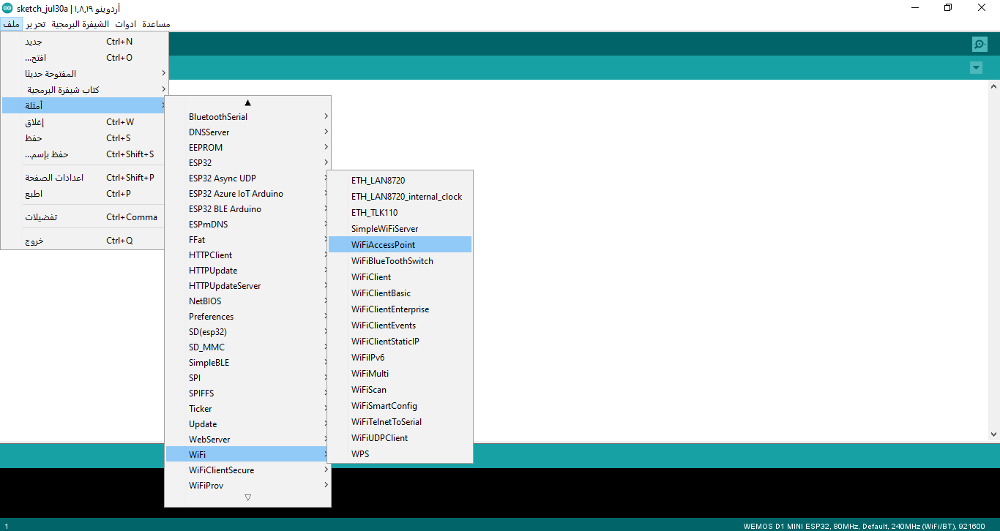
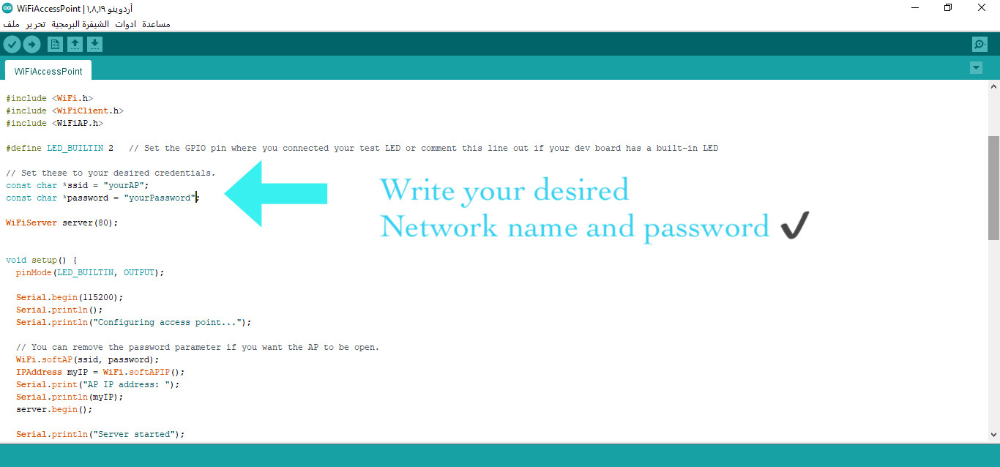
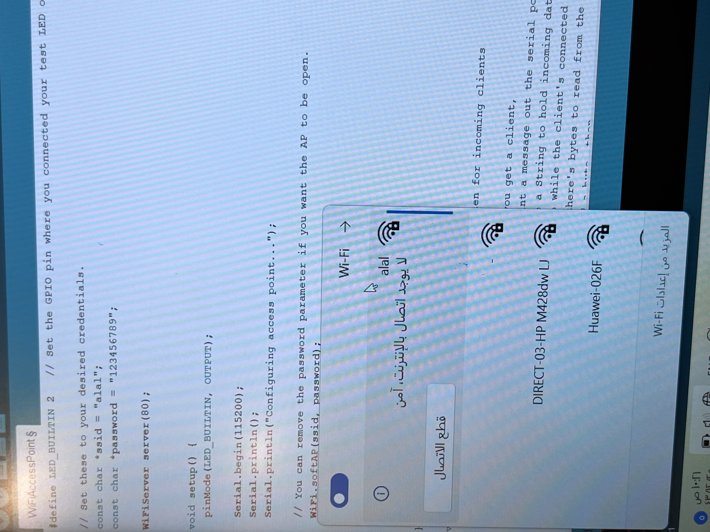
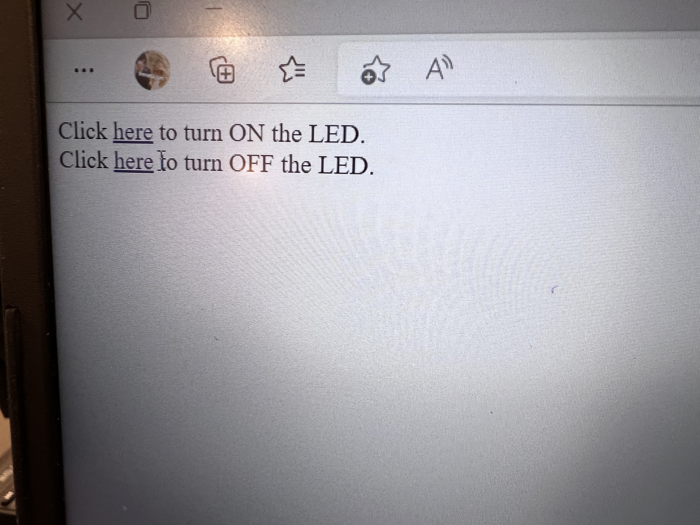
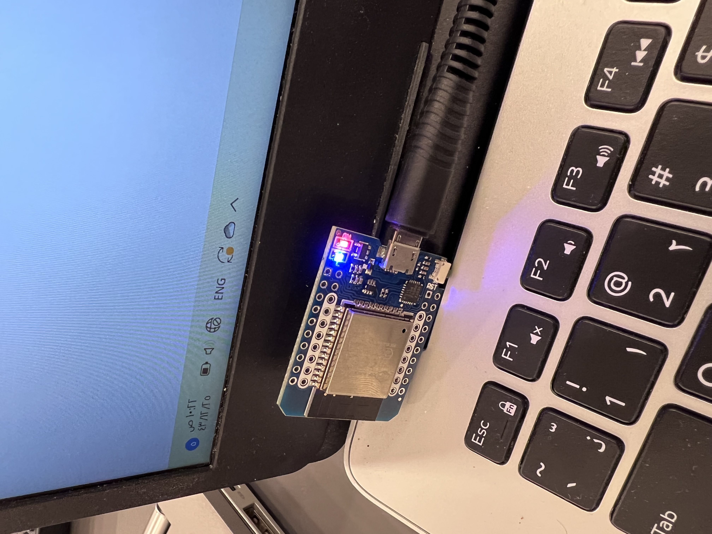

Few steps to follow if you want to control the power of Arduino led. 

- #### 1 - Open Arduino, then File - Examples - Wifi - WifiAccessPoint 

- #### 2 - Change the ssid and password to your desired network and password 

- #### 3 - Go to the networks in your laptop and search for the network name you choosed and enter the password

- #### 4 - After that go back to arduino ide and upload the code. A web page will open, choose from it if you either want to power off or power on your arduino board lamp. 

Finally you can see that the led is opened/closed according to your choice on the web page. 

